# 编写简单的GraphQL服务器

[教程来源](https://www.howtographql.com)

[官方文档](http://graphql.org/learn/)

## 0. 准备工作

- 安装相关依赖

```bash
yarn add koa koa-bodyparser koa-router apollo-server-koa graphql-tools graphql mongoose
```

## 1. 查询

- 在`src/schema/index.js`中编写类型定义，注意要用字符串形式。

```javascript
const typeDefs = `
  type Link {
    id: ID!
    url: String!
    description: String!
  }

  type Query {
    allLinks: [Link!]!
  }
`;
```

类型定义中，我们定义了一个有3个属性的类型`Link`，同时定义了`allLinks`，这个查询会返回一个含有若干`Link`的数组。

- 在`src/schema/resolovers.js`中编写求解方法。在与数据库打交道之前，暂时先以硬编码的方式把数据内容写在此处。

```javascript
const links = [
  {
    id: 1,
    url: 'http://graphql.org/',
    description: 'The Best Query Language'
  },
  {
    id: 2,
    url: 'http://dev.apollodata.com',
    description: 'Awesome GraphQL Client'
  },
];

module.exports = {
  Query: {
    allLinks: () => links,
  },
};
```

求解方法告诉`GraphQL`如何对`allLinks`这个查询作出回应，这里是直接返回定义好的内容。其中的`allLinks`名称应当与之前的类型定义里的对应。

- 在`src/schema/index.js`中使用`graphql-tools`提供的工具，结合刚才的类型定义和求解方法生成schema并导出。

```javascript
const {makeExecutableSchema} = require('graphql-tools');
const resolvers = require('./resolvers');

// ...

module.exports = makeExecutableSchema({typeDefs, resolvers});
```

- 在`src/index.js`中编写、应用路由和中间件。

```javascript
const koa = require('koa');
const koaRouter = require('koa-router');
const koaBody = require('koa-bodyparser');
const { graphqlKoa, graphiqlKoa } = require('apollo-server-koa');

const schema = require('./schema');

const app = new koa();
const router = new koaRouter();
const PORT = 3000;

router.post('/graphql', koaBody(), graphqlKoa({ schema }));
router.get('/graphql', graphqlKoa({ schema }));
router.get('/graphiql', graphiqlKoa({ endpointURL: '/graphql' }));

app.use(router.routes());
app.use(router.allowedMethods());
app.listen(PORT, () => {
  console.log(`Server is running. Test server on http://localhost:${PORT}/graphiql .`);
});
```

`GraphiQL`是一个浏览器内部的有图形化界面的交互式IDE，可以让我们方便地测试服务器的功能。

- 测试服务器

启动服务器。

```bash
node ./src/index.js
```

访问 http://localhost:3000/graphiql 。

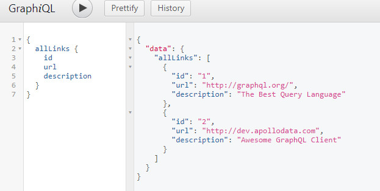

## 2. 变更

- 在`src/schema/index.js`中添加类型定义。

```
  type Mutation {
    createLink(url: String!, description: String!): Link
  }
```

这里定义了一个名为`createLink`的变更，它接收2个字符串作为参数，同时返回一个`Link`类型的对象。

- 在`src/schema/resolovers.js`中添加求解方式。

```javascript
  Mutation: {
    createLink: (_, data) => {
      const newLink = Object.assign({ id: links.length + 1 }, data);
      links.push(newLink);
      return newLink;
    },
  },
```

这里创建一个新对象并添加到`links`数组里。`data`参数是一个对象，包含了用于查询的参数（在本例中有`url`和`description`）。

- 测试服务器

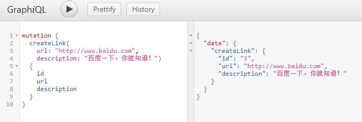

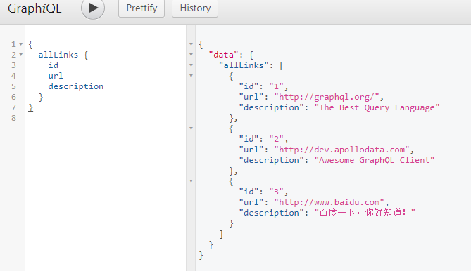

## 3. 连接数据库

- 开启mongoDB服务器。

- 在`src/mongo-connector.js`中定义`Link`的模型并导出，同时进行连接mongoDB服务器的操作。

```javascript
const mongoose = require('mongoose');
const Schema = mongoose.Schema;
const MONGO_URL = 'mongodb://localhost:27017/hackernews' 

const linkSchema = new Schema({
  url: String,
  description: String
})

mongoose.Promise = global.Promise;
mongoose.connect(MONGO_URL, { useMongoClient: true });

module.exports = mongoose.model('Links', linkSchema)
```

- 在`src/index.js`里获取上面文件导出的内容，并包装在`context`里。这样在求解方法的第三个参数中可以获取它，从而进行数据库操作。

```javascript
const Links = require('./mongo-connector');
router.post(
  '/graphql',
  koaBody(),
  graphqlKoa({
    context: { Links },
    schema,
  })
);
router.get(
  '/graphql',
  graphqlKoa({
    context: { Links },
    schema,
  })
);
```

- 把`src/schema/resolovers.js`里原来硬编码的内容删掉，因为已经使用数据库了。同时修改其内容，使用数据库的操作方式。

```javascript
module.exports = {
  Query: {
    allLinks: async (root, data, { Links }) => {
      return await Links.find();
    },
  },
  Mutation: {
    createLink: async (root, data, { Links }) => {
      return await Links.create(data);
    },
  }
};
```

值得一提的是，`mongoose`里面会自动给你添加一个`_id`属性，而不是`id`。但同时它也提供一个`id`的`setter`，使得你直接访问`id`即可获得`_id`的内容。因此这里不再需要编写`Links.id`的求解方法。

另外，这里直接假定数据库操作成功，而暂时没有处理异步出错的情况，仅作为演示使用。

- 测试服务器

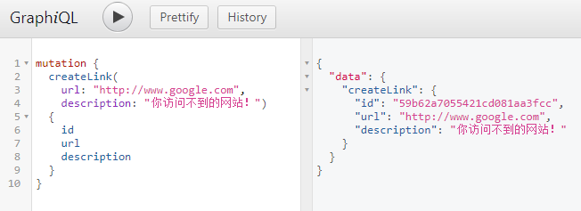

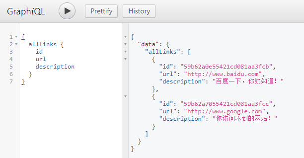

查看数据库内部：

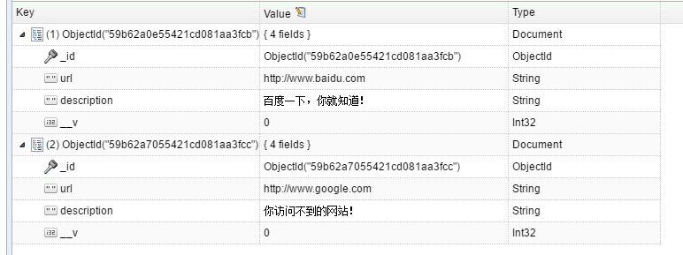

## 4. 授权

- 安装需要用到的`jsonwebtoken`

```bash
yarn add jsonwebtoken
```

- 新建`src/config/index.js`，导出配置。内容暂时只有一个，就是服务器的`SECRET`。

```javascript
module.exports = {
  SECRET: "secret"
}
```

- 在`src/schema/index.js`里添加`User`的类型定义

```
  type User {
    id: ID!
    name: String!
    password: String!
  }

  type SigninPayload {
    token: String
    user: User
  }

  type Mutation {
    createUser(name: String!, password: String!): User
    signinUser(name: String!, password: String!): SigninPayload!
  }
```

上面除了添加了新建用户的方法，还添加了注册函数的方法，它们都接收`name`和`password`两个参数，前者返回一个`User`对象，后者返回一个`SigninPayload`对象，内含token和user。

- 在`src/mongo-connector.js`里添加`mongoose`的`User`定义。

```javascript
const userSchema = new Schema({
  name: String,
  password: String,
});

module.exports = {
  Links: mongoose.model('Links', linkSchema),
  Users: mongoose.model('Users', userSchema),
};
```

- 在`src/schema/resolovers.js`里添加求解方法。

```javascript
const jwt = require('jsonwebtoken');
const { SECRET } = require('../config');

Mutation: {
  createUser: async (root, data, { mongo: { Users } }) => {
    return await Users.create(data);
  }
  SigninUser: async (root, data, { mongo: { Users } }) => {
    const user = await Users.findOne({ name: data.name });
    if (data.password === user.password) {
      return {
        token: jwt.sign({ id: user.id }, SECRET),
        user,
      };
    }
  },
}
```

这里建立用户仅供演示，并没有增加什么验证方式（例如，可能出现用户名相同的情况，导致后续出错，但这里不考虑）。

在用户登入过程中，使用`jsonwebtoken`库，用预定义的`SECRET`把用户的`id`生成一串`token`作为响应。

在以后的请求中，应当带上这样的请求头：

```json
  "Authorization": "Bearer xxxx"
```

其中xxxx就是刚刚得到的`token`，这是用来验证用户身份的。具体可以参考[jsonwebtoken](http://jwt.io/introduction/)。

- 新增`src/authentication.js`，他会检验传入的请求的`header`里是否有我们希望的`token`，并尝试解码出用户的`id`。注意这里如果检验失败，返回值就是`undefined`了。

```javascript
const jwt = require('jsonwebtoken');
const { SECRET } = require('./config');

module.exports.authenticate = async (ctx, Users) => {
  if (!ctx.header || !ctx.header.authorization) {
    return;
  }

  const parts = ctx.header.authorization.split(' ');

  if (parts.length === 2) {
    const scheme = parts[0];
    const token = parts[1];

    if (/^Bearer$/i.test(scheme)) {
      const { id } = jwt.verify(token, SECRET);
      return await Users.findOne({ _id: id });
    }
  }
};
```

- 略微修改`src/index.js`，以适应`src/mongo-connector.js`的`exports`的改动。同时引入上面的授权手段。

```javascript
const { authenticate } = require('./authentication');
const mongo = require('./mongo-connector');

const buildOptions = async ctx => {
  const user = await authenticate(ctx, mongo.Users);
  return {
    context: { mongo, user },
    schema,
    debug: false,
  };
};

router.post('/graphql', koaBody(), graphqlKoa(buildOptions));
```

这里用一个函数`buildOptions`取代了原来固定的对象，这样可以根据`ctx`的情况来动态生成`context`。另外这里`debug`的值的含义是，当有错误被抛出时，是否在控制台打印错误信息及其调用栈。默认值是`true`，方便调试。

- 回到`src/schema/index.js`，修改`Link`的定义，这样可以记录这个`Link`是谁发布的。

```
type Link {
    id: ID!
    url: String!
    description: String!
    postedBy: User
}
```

- 回到`src/schema/resolovers.js`，更新求解方法。这里检测如果`context`里没有`user`，就抛出错误，否则就正常新建链接。另外要编写`Link.postedBy`的求解方法，也就是根据`id`去数据库里找出对应的用户就好了。

```javascript
Mutation: {
  createLink: async (root, data, { mongo: { Links }, user }) => {
    if (!user)
      throw new Error('Unauthorized');
    const newLink = Object.assign({ postedById: user._id }, data);
    return await Links.create(newLink);
  }
}
Link: {
  postedBy: async ({ postedById }, data, { mongo: { Users } }) => {
    return await Users.findOne({ _id: postedById });
  }
}
```

- 为了能使用`GraphiQL`正常测试，修改`src/index.js`。下面的xxxx要替换成计算的`token`。

```javascript
router.get(
  '/graphiql',
  graphiqlKoa({
    endpointURL: '/graphql',
    passHeader: `'Authorization': 'Bearer xxxx'`,
  })
);
```

- 测试服务器

新建用户

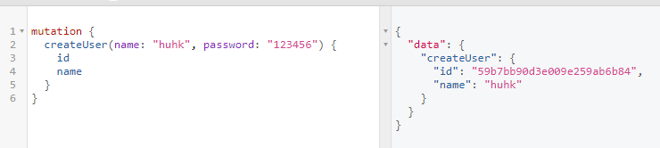

用户登入

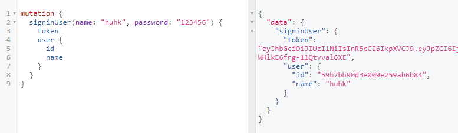

新建链接-已授权

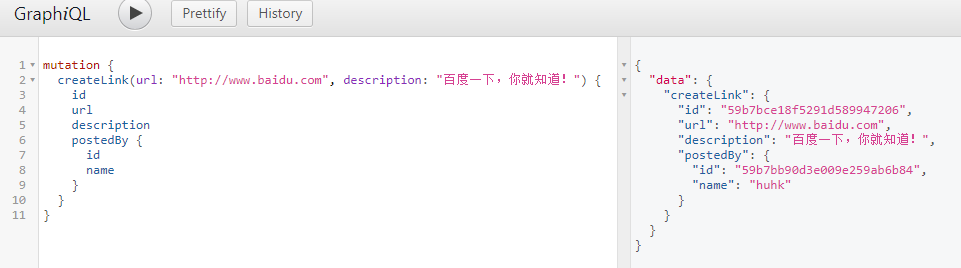

全部链接

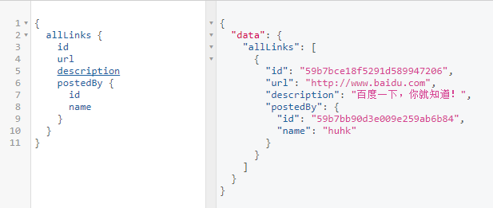

新建链接-未授权

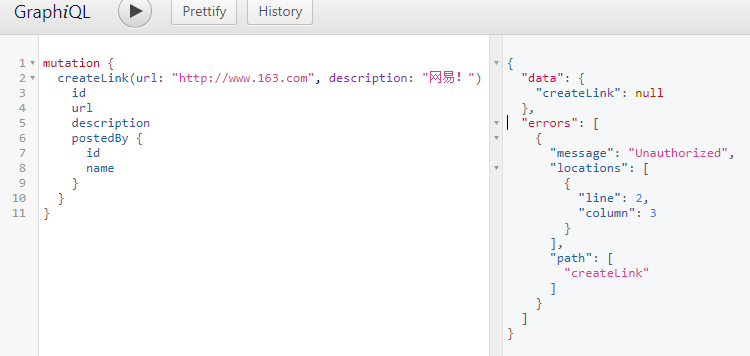

## 5. 更多更改

- 在`src/schema/index.js`里新增一个方法`createVote`, 新增一个类型`Vote`，并且修改`Link`和`User`的定义。

```
type Link {
  id: ID!
  url: String!
  description: String!
  postedBy: User!
  votes: [Vote!]!
}

type User {
  id: ID!
  name: String!
  password: String!
  votes: [Vote!]!
}

type Mutation {
  createLink(url: String!, description: String!): Link
  createVote(linkId: ID!): Vote
  createUser(name: String!, authProvider: AuthProviderSignupData!): User
  signinUser(email: AUTH_PROVIDER_EMAIL): SigninPayload!
}
```

- 在`src/mongo-connector.js`里补充`Vote`的模型。

```javascript
const VoteSchema = new Schema({
  userId: Schema.Types.ObjectId,
  linkId: Schema.Types.ObjectId,
});

module.exports = {
  Links: mongoose.model('Links', linkSchema),
  Users: mongoose.model('Users', userSchema),
  Votes: mongoose.model('Votes', VoteSchema),
};
```

注意这里我们只储存了id，到时候根据id去数据库拿出具体的对象。

- 在`src/schema/resolovers.js`里编写`createVote`的求解方法，以及`Vote.user`和`Vote.link`的求解，还有`Link.votes`和`User.votes`的求解。

```javascript
module.exports = {
  Link: {
    votes: async ({ _id }, data, { mongo: { Votes } }) => {
      return await Votes.find({ linkId: _id });
    },
  },
  User: {
    votes: async ({ _id }, data, { mongo: { Votes } }) => {
      return await Votes.find({ userId: _id });
    },
  },
  Vote: {
    user: async ({ userId }, data, { mongo: { Users } }) => {
      return await Users.findOne({ _id: userId });
    },
    link: async ({ linkId }, data, { mongo: { Links } }) => {
      return await Links.findOne({ _id: linkId });
    },
  },
  Mutation: {
    createVote: async (root, data, { mongo: { Votes }, user }) => {
      if (!user) throw new Error('Unauthorized');
      const newVote = Object.assign({ userId: user._id }, data);
      return await Votes.create(newVote);
    }
  }
};
```

从上面的求解方法可以看出，其实就是根据id去查对应的对象而已。

- 测试服务器

新建投票

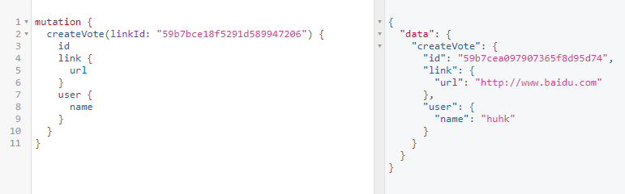


下面的例子中，`huhk`用户为百度和网易链接各投一票，`xiaoming`用户为百度链接投了一票。

查看为某个`Link`投票的`User`：

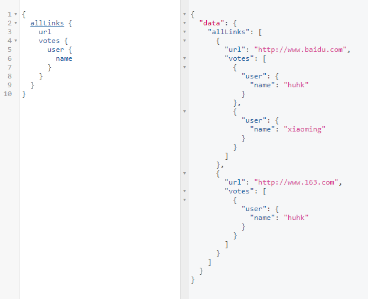


查看某个`User`投过的`Link`（还有一部分响应未截图）：
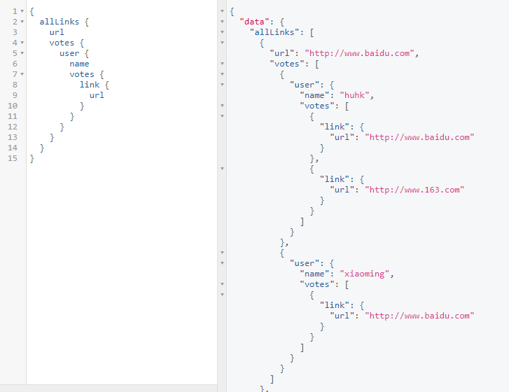